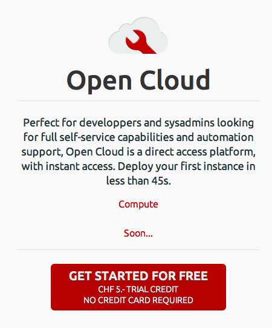
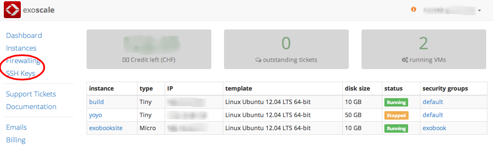
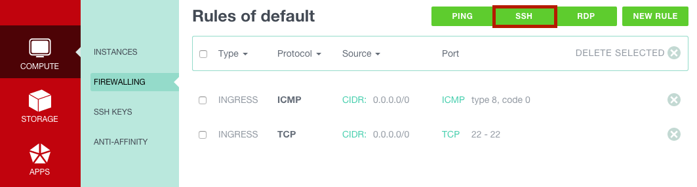
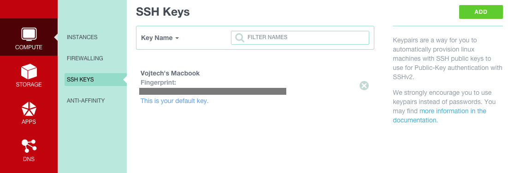
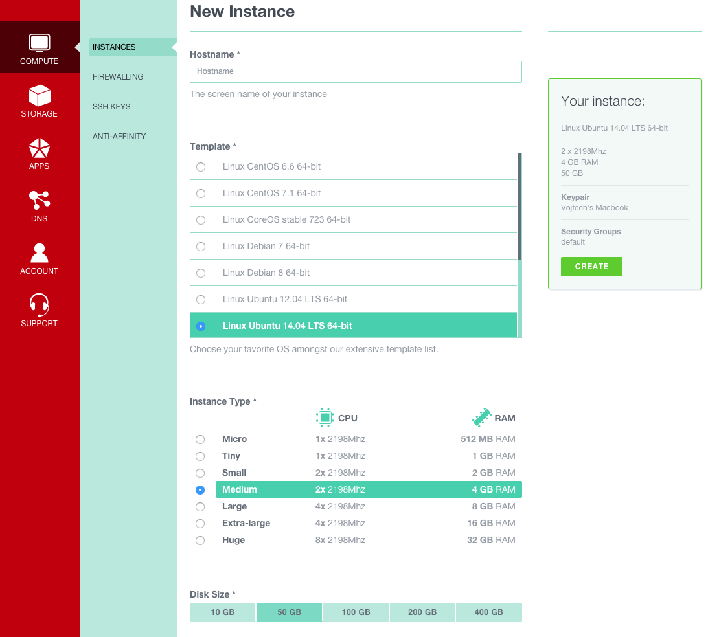
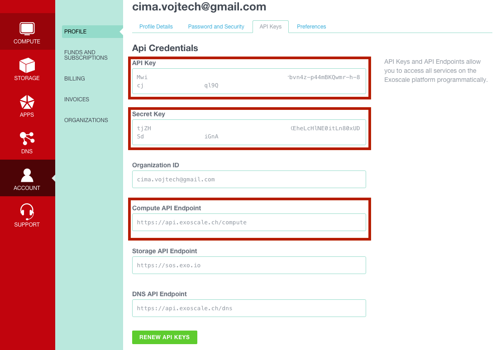
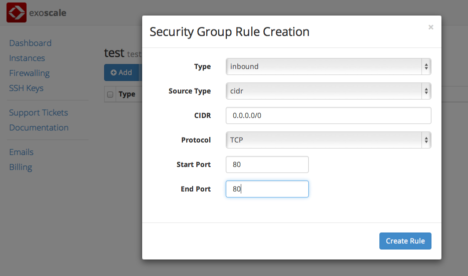

Exobook
=======

A book of exercises to learn CloudStack using [exoscale](http://exoscale.ch)

These instructions aim to give an introduction to Apache CloudStack. You will be accessing a production cloud based on CloudStack, getting a feel for it through the UI, then using a few tools to provision and configure machines in the cloud. For a more complete guide see this [Little Book](https://github.com/runseb/cloudstack-books/blob/master/en/clients.markdown)
 
What we will do in this tutorial is:

0. Getting your feet wet with [exoscale](http://exoscale.ch)
1. Using [CloudMonkey](https://pypi.python.org/pypi/cloudmonkey/)
2. Discovering Apache [libcloud](http://libcloud.apache.org)
3. Using [Vagrant](http://vagrantup.com) boxes and deploying instances in the cloud
4. Using [Ansible](http://ansibleworks.com) configuration management tool
5. Using the AWS [CLI](http://aws.amazon.com/cli/) with the CloudStack EC2 interface [`ec2stack`](https://github.com/BroganD1993/ec2stack)

I wrote this book on my copious spare time while my wife was sleeping. If you would like to see more, reach out to me on Twitter: @sebgoa

And don't hestitate to donate :)

Feet Wet with [exoscale](http://exoscale.ch)
============================================

To get started, we are going to access `exoscale` a CloudStack based cloud in Switzerland.

We will first use the UI to create SSH key pairs, Security Groups and launch instances.

We will then find our API keys and use the user-data to configure an instance.

Exoscale Sign-up
----------------

Go to [exoscale](http://exoscale.ch) and signup

If you can talk to me :) ask me for a voucher which contains a coupon code.

Discover the UI and start an instance 
-------------------------------------
 
Browse the UI, identify the `security groups` and `keypairs` sections.

Create a rule in your default security group to allow inbound traffic on port 22 (ssh)

Create a keypair and store the private key on your machine. CloudStack does not store the private key, so make sure you save it in your `~/.ssh` directory.

Start an instance by clicking on the `Instances` tab and then the `Add` button.

You can then give a name to your instance, select a template, a machine type, a security group and a keypair.

ssh to the instance using the keys that you created earlier:

    ssh -i /path/to/key root@<IP of instance>

Find your API Keys 
------------------

The exoscale UI is great and so is the default CloudStack UI, however the `cloud` is really about API access.

Find your API keys on the exoscale UI by clicking on the top right corner on your email address.

You will then see your keys in the `API details` tab like on the snapshot below:

Using UserData
--------------

Similarly to AWS, CloudStack supports `userdata`. We can therefore pass a script to the deploy virtual machine call.
Exoscale templates are setup with [cloudinit](https://help.ubuntu.com/community/CloudInit) which will parse the userdata and do what's required.

In this exericse we put a bash script in the UI user-data field and deploy `wordpress`.

Open port 80 on the default security group.

Start an Ubuntu 12.04 instance and in the User-Data tab input:

    #!/bin/sh
    set -e -x

    apt-get --yes --quiet update
    apt-get --yes --quiet install git puppet-common

    #
    # Fetch puppet configuration from public git repository. 
    #

    mv /etc/puppet /etc/puppet.orig
    git clone https://github.com/retrack/exoscale-wordpress.git /etc/puppet
 
    #
    # Run puppet.
    #

    puppet apply /etc/puppet/manifests/init.pp

Now open your browser on port 80 of the IP of your instance and Voila !

CloudMonkey
===========

The `exoscale` cloud is based on CloudStack. It exposes the CloudStack native API.
In this section we will learn about *CloudMonkey*, the ACS command line interface.

CloudMonkey is an official release of the Apache CloudStack project you can find it on [github](https://github.com/apache/cloudstack-cloudmonkey).
It is also available on [pypi](https://pypi.python.org/pypi/cloudmonkey/) as we are going to see shortly.

Installation
------------

`CloudMonkey` is available from the Cheese Shop :), installing it is as easy as:
 
    $pip install cloudmonkey

Of course you will need `pip`, in case you have not installed it already, get it on Ubuntu with:

    $apt-get -y install python-pip

If you are familiar with `virtualenv`, just create one and install `cloudmonkey` in it.

To test that your installation was successful just type `cloudmonkey` at the prompt and press enter.

Configuration
-------------

At the `cloudmonkey` prompt use the `set` command to point to `exoscale`:

    >set url https://api.exoscale.ch/compute
    >set apikey <yourapikey>
    >set secretkey <secretkey>

These settings are saved in `~/.cloudmonkey/config`, check that file and see the settings.
You can edit that file directly.

You are now ready to make calls to `exoscale` using CloudMonkey.

Tabular Output
--------------------

The number of key/value pairs returned by the api calls can be large
resulting in a very long output. To enable easier viewing of the output,
a tabular formatting can be setup. You may enable tabular listing and
even choose set of column fields, this allows you to create your own
field using the filter param which takes in comma separated argument. If
argument has a space, put them under double quotes. The create table
will have the same sequence of field filters provided

To enable it, use the *set* function and create filters like so:

    > set display table
    > list zones filter=name,id
    count = 1
    zone:
    +--------+--------------------------------------+
    |  name  |                  id                  |
    +--------+--------------------------------------+
    | CH-GV2 | 1128bd56-b4d9-4ac6-a7b9-c715b187ce11 |
    +--------+--------------------------------------+

Try a few `list` calls and play with the filter

Starting a Virtual Machine instance with CloudMonkey
------------------------------------------------------------------------

To start a virtual machine instance we will use the *deployvirtualmachine* call.

    cloudmonkey>deploy virtualmachine -h
    Creates and automatically starts a virtual machine based on a service offering, disk offering, and template.
    Required args: serviceofferingid templateid zoneid
    Args: account diskofferingid displayname domainid group hostid hypervisor ipaddress iptonetworklist isAsync keyboard keypair name networkids projectid securitygroupids securitygroupnames serviceofferingid size startvm templateid userdata zoneid

The required arguments are *serviceofferingid, templateid and zoneid*

In order to specify the template that we want to use, we can list all
available templates with the following call:

     > list templates filter=id,displaytext templatefilter=executable
    count = 36
    template:
    +--------------------------------------+------------------------------------------+
    |                  id                  |               displaytext                |
    +--------------------------------------+------------------------------------------+
    | 3235e860-2f00-416a-9fac-79a03679ffd8 | Windows Server 2012 R2 WINRM 100GB Disk  |
    | 20d4ebc3-8898-431c-939e-adbcf203acec |   Linux Ubuntu 13.10 64-bit 10 GB Disk   |
    | 70d31a38-c030-490b-bca9-b9383895ade7 |   Linux Ubuntu 13.10 64-bit 50 GB Disk   |
    | 4822b64b-418f-4d6b-b64e-1517bb862511 |  Linux Ubuntu 13.10 64-bit 100 GB Disk   |
    | 39bc3611-5aea-4c83-a29a-7455298241a7 |  Linux Ubuntu 13.10 64-bit 200 GB Disk   |
    ...<snipped>

Similarly to get the *serviceofferingid* you would do:

    > list serviceofferings filter=id,name
    count = 7
    serviceoffering:
    +--------------------------------------+-------------+
    |                  id                  |     name    |
    +--------------------------------------+-------------+
    | 71004023-bb72-4a97-b1e9-bc66dfce9470 |    Micro    |
    | b6cd1ff5-3a2f-4e9d-a4d1-8988c1191fe8 |     Tiny    |
    | 21624abb-764e-4def-81d7-9fc54b5957fb |    Small    |
    | b6e9d1e8-89fc-4db3-aaa4-9b4c5b1d0844 |    Medium   |
    | c6f99499-7f59-4138-9427-a09db13af2bc |    Large    |
    | 350dc5ea-fe6d-42ba-b6c0-efb8b75617ad | Extra-large |
    | a216b0d1-370f-4e21-a0eb-3dfc6302b564 |     Huge    |
    +--------------------------------------+-------------+

Note that we can use the linux pipe as well as standard linux commands
within the interactive shell. Finally we would start an instance with
the following call:

    cloudmonkey>deploy virtualmachine templateid=20d4ebc3-8898-431c-939e-adbcf203acec zoneid=1128bd56-b4d9-4ac6-a7b9-c715b187ce11 serviceofferingid=71004023-bb72-4a97-b1e9-bc66dfce9470
    id = 5566c27c-e31c-438e-9d97-c5d5904453dc
    jobid = 334fbc33-c720-46ba-a710-182af31e76df

This is an asynchronous job, therefore it returns a `jobid`, you can query the state of this job with:

    > query asyncjobresult jobid=334fbc33-c720-46ba-a710-182af31e76df
    accountid = b8c0baab-18a1-44c0-ab67-e24049212925
    cmd = com.cloud.api.commands.DeployVMCmd
    created = 2014-03-05T13:40:18+0100
    jobid = 334fbc33-c720-46ba-a710-182af31e76df
    jobinstanceid = 5566c27c-e31c-438e-9d97-c5d5904453dc
    jobinstancetype = VirtualMachine
    jobprocstatus = 0
    jobresultcode = 0
    jobstatus = 0
    userid = 968f6b4e-b382-4802-afea-dd731d4cf9b9

Once the machine is started you can list it:

    > list virtualmachines filter=id,displayname
    count = 1
    virtualmachine:
    +--------------------------------------+--------------------------------------+
    |                  id                  |             displayname              |
    +--------------------------------------+--------------------------------------+
    | 5566c27c-e31c-438e-9d97-c5d5904453dc | 5566c27c-e31c-438e-9d97-c5d5904453dc |
    +--------------------------------------+--------------------------------------+

The instance would be stopped with:

    > stop virtualmachine id=5566c27c-e31c-438e-9d97-c5d5904453dc
    jobid = 391b4666-293c-442b-8a16-aeb64eef0246

    > list virtualmachines filter=id,displayname,state
    count = 1
    virtualmachine:
    +--------------------------------------+--------------------------------------+---------+
    |                  id                  |             displayname              |  state  |
    +--------------------------------------+--------------------------------------+---------+
    | 5566c27c-e31c-438e-9d97-c5d5904453dc | 5566c27c-e31c-438e-9d97-c5d5904453dc | Stopped |
    +--------------------------------------+--------------------------------------+---------+
        
The *ids* that you will use will differ from this example. Make sure you use the ones that corresponds to your CloudStack cloud.

With CloudMonkey all CloudStack APIs are available.

Libcloud
========

[Libcloud](http://libcloud.apache.org) is a python module that abstracts the different APIs of most cloud providers. It offers a common API for the basic functionality of clouds list nodes,sizes,templates, create nodes etc...Libcloud can be used with CloudStack, OpenStack, Opennebula, GCE, AWS.

Check the CloudStack driver [documentation](https://libcloud.readthedocs.org/en/latest/compute/drivers/cloudstack.html)

For a presentation on `libcloud` check my [slides](http://www.slideshare.net/sebastiengoasguen/apache-libcloud) from Apachecon NA 2014.

In this section we will install `libcloud` and connect to [exoscale](http://exoscale.ch) using the CloudStack driver.

Installation
------------

To install Libcloud refer to the libcloud [website](http://libcloud.apache.org). Or simply do:

    $pip install apache-libcloud

You should have installed `pip` of course, if not do `apt-get -y install python-pip` or an equivalent.

Generic use of Libcloud with CloudStack
---------------------------------------

With libcloud installed, you can now open a Python interactive shell, create an instance of a CloudStack driver
and call the available methods via the libcloud API.

This is a basic introduction, the exercise follows in the next section.

First you need to import the libcloud modules and create a CloudStack
driver.

    >>> from libcloud.compute.types import Provider
    >>> from libcloud.compute.providers import get_driver
    >>> Driver = get_driver(Provider.CLOUDSTACK)

Then, using your keys and endpoint, create a connection object. Note
that this is a local test and thus not secured. If you use a CloudStack
public cloud, make sure to use SSL properly (i.e `secure=True`). Replace the host and path with the ones of your public cloud. For exoscale use `host='http://api.exoscale.ch` and `path=/compute` like so:

    >>> apikey='plgWJfZK4gyS3mlZLYq_u38zCm0bewzGUdP66mg'
    >>> secretkey='VDaACYb0LV9eNjeq1EhwJaw7FF3akA3KBQ'
    >>> host='https://api.exoscale.ch'
    >>> path='/compute'
    >>> conn=Driver(key=apikey,secret=secretkey,secure=True,host=host,port='443',path=path)

With the connection object in hand, you now use the libcloud base api to
list such things as the templates (i.e images), the service offerings
(i.e sizes) and the zones (i.e locations)

    >>> conn.list_images()
    [<NodeImage: id=13ccff62-132b-4caf-b456-e8ef20cbff0e, name=tiny Linux, driver=CloudStack  ...>]
    >>> conn.list_sizes()
    [<NodeSize: id=ef2537ad-c70f-11e1-821b-0800277e749c, name=tinyOffering, ram=100 disk=0 bandwidth=0 price=0 driver=CloudStack ...>,
        <NodeSize: id=c66c2557-12a7-4b32-94f4-48837da3fa84, name=Small Instance, ram=512 disk=0 bandwidth=0 price=0 driver=CloudStack ...>,
        <NodeSize: id=3d8b82e5-d8e7-48d5-a554-cf853111bc50, name=Medium Instance, ram=1024 disk=0 bandwidth=0 price=0 driver=CloudStack ...>]
    >>> images=conn.list_images()
    >>> offerings=conn.list_sizes()

The `create_node` method will take an instance name, a template and an
instance type as arguments. It will return an instance of a
*CloudStackNode* that has additional extensions methods, such as
`ex_stop` and `ex_start`.

    >>> node=conn.create_node(name='toto',image=images[0],size=offerings[0])
    >>> help(node)
    >>> node.get_uuid()
    'b1aa381ba1de7f2d5048e248848993d5a900984f'
    >>> node.name
    u'toto'

libcloud with exoscale
----------------------

Libcloud also has an exoscale specific driver. For complete description see this recent [post](https://www.exoscale.ch/syslog/2014/01/27/licloud-guest-post/) from Tomaz Murauz the VP of Apache Libcloud.

To get you started quickly, save the following script in a .py file.

    #!/usr/bin/env python

    import sys
    import os

    from IPython.terminal.embed import InteractiveShellEmbed
    from libcloud.compute.types import Provider
    from libcloud.compute.providers import get_driver
    from libcloud.compute.deployment import ScriptDeployment
    from libcloud.compute.deployment import MultiStepDeployment

    apikey=os.getenv('EXOSCALE_API_KEY')
    secretkey=os.getenv('EXOSCALE_SECRET_KEY')
    Driver = get_driver(Provider.EXOSCALE)
    conn=Driver(key=apikey,secret=secretkey)

    print conn.list_locations()

    def listimages():
        for i in conn.list_images():
            print i.id, i.extra['displaytext']

    def listsizes():
        for i in conn.list_sizes():
            print i.id, i.name

    def getimage(id):
        return [i for i in conn.list_images() if i.id == id][0]

    def getsize(id):
        return [i for i in conn.list_sizes() if i.id == id][0]

    script=ScriptDeployment("/bin/date")
    image=getimage('8c7e60ae-3a30-4031-a3e6-29832d85d7cb')
    size=getsize('71004023-bb72-4a97-b1e9-bc66dfce9470')
    msd = MultiStepDeployment([script])

    # directly open the shell
    shell = InteractiveShellEmbed(banner1="Hello from Libcloud Shell !!")
    shell()

Set your API keys properly as environment variables and install IPython.

Start this shell by executing the script:

    $ ./libshell.py
    [<NodeLocation: id=1128bd56-b4d9-4ac6-a7b9-c715b187ce11, name=CH-GV2, country=Unknown, driver=Exoscale>]
    Hello from Libcloud Shell !!
    In [1]: 

At the prompt type `conn.list` and press the tab key to see the list of available `list` apis.

You can now explore the libcloud API interactively.

Try to create a SSH key pair with `conn.create_key_pair()`, list the key pairs with `conn.list_key_pairs()`, delete it...

Creating and Deploying a node
-----------------------------

As with previous clients try to start an instance

    conn.create_node(name='foobar',image=image,size=size)

This simple command will us the default security group and your default keypair.

Explore the `create_node` method to see how to specify a security group and a SSH key pair that is not the default one.

Libcloud also allows to start an instance and execute a script to configure it.

Looking through the interactive shell script you saved in the previous section, you should see the `ScriptDeployment()` and `MultiStepDeployment()` classes.

Edit the file so the script specified in `ScriptDeployment` is the same that you used earlier to deploy wordpress from the exoscale UI, for example something like this:

    wordpress=open('wordpress.sh','r')
    script=ScriptDeployment(wordpress)

Now relaunch the interactive shell and deploy the node with:

    conn.deploy_node(name='wordpresslibcloud',image=image,size=size,ex_keyname='exoscale',pub_key_identity='<path/to/private/key',deploy=msd)

When it completes, check the `stdout` with:

    script.stdout

Open your browser and go to `http://<ip of instance started>` if all went well, you should see wordpress :)

Vagrant
=======

[Vagrant](http://vagrantup.com) is a tool to create *lightweight, portable and reproducible development environments*. Specifically it allows you to use configuration management tools to configure a virtual machine locally (via virtualbox) and then deploy it *in the cloud* via Vagrant providers. 

In this next exercise we are going to install vagrant on our local machine and use Exoscale vagrant boxes to provision VM in the Cloud using configuration setup in Vagrant. For future reading check this [post](http://sebgoa.blogspot.co.uk/2013/12/veewee-vagrant-and-cloudstack.html)

Install Vagrant and create the exo boxes
----------------------------------------

First install [Vagrant](http://www.vagrantup.com/downloads.html) and then get the cloudstack plugin:

    vagrant plugin install vagrant-cloudstack

Then we are going to clone a small github [project](https://github.com/exoscale/vagrant-exoscale-boxes) from exoscale. This project is going to give us *vagrant boxes*, fake virtual machine images that refer to Exoscale templates available.

    git clone https://github.com/exoscale/vagrant-exoscale-boxes
    cd vagrant-exoscale-boxes

Edit the `config.py` script to specify your API keys, then run:

    python ./make-boxes.py

If you are familiar with Vagrant this will be straightforward, if not, you need to add a box to your local installation for instance:

    vagrant box add Linux-Ubuntu-13.10-64-bit-50-GB-Disk /path/or/url/to/boxes/Linux-Ubuntu-13.10-64-bit-50-GB-Disk.box

Initialize a `Vagrantfile` and start an instance
----------------------------------------------

Now you need to create a *Vagrantfile*. In the directory of you choice  for example `/tutorial` do:

    vagrant init

Then edit the `Vagrantfile` created to contain this:

    Vagrant.configure("2") do |config|
        config.vm.box = "Linux-Ubuntu-13.10-64-bit-50-GB-Disk"
        config.ssh.username = "root"
        config.ssh.private_key_path = "/Users/vagrant/.ssh/id_rsa.vagrant"

        config.vm.provider :cloudstack do |cloudstack, override|
            cloudstack.api_key = "AAAAAAAAAAAAAAAA-aaaaaaaaaaa"
            cloudstack.secret_key = "SSSSSSSSSSSSSSSS-ssssssssss"

            # Uncomment ONE of the following service offerings:
            cloudstack.service_offering_id = "71004023-bb72-4a97-b1e9-bc66dfce9470" # Micro - 512 MB
            #cloudstack.service_offering_id = "b6cd1ff5-3a2f-4e9d-a4d1-8988c1191fe8" # Tiny - 1GB
            #cloudstack.service_offering_id = "21624abb-764e-4def-81d7-9fc54b5957fb" # Small - 2GB
            #cloudstack.service_offering_id = "b6e9d1e8-89fc-4db3-aaa4-9b4c5b1d0844" # Medium - 4GB
            #cloudstack.service_offering_id = "c6f99499-7f59-4138-9427-a09db13af2bc" # Large - 8GB
            #cloudstack.service_offering_id = "350dc5ea-fe6d-42ba-b6c0-efb8b75617ad" # Extra-large - 16GB
            #cloudstack.service_offering_id = "a216b0d1-370f-4e21-a0eb-3dfc6302b564" # Huge - 32GB

            cloudstack.keypair = "vagrant" # for SSH boxes the name of the public key pushed to the machine
        end
    end

Make sure to set your API keys and your keypair properly. Also edit the `config.vm.box` line to set the name of the box you actually added with `vagrant box add` and edit the `config.ssh.private_key_path` to point to the private key you got from exoscale. In this configuration the default security group will be used.

You are now ready to bring the box up:

    vagrant up --provider=cloudstack

Don't forget to use the `--provider=cloudstack` or the box won't come up. Check the exoscale dashboard to see the machine boot, try to ssh into the box.

Provisioning steps
----------------------

Once you have successfully started a machine with vagrant, you are ready to specify a provisioning script. Create a `boostrap.sh` bash script in your working directory and make it do whatever you want.

Add this provisioning step in the `Vagrantfile` like so:

    # Test bootstrap script
    config.vm.provision :shell, :path => "bootstrap.sh"

Relaunch the machine with `vagrant up` or `vagrant reload --provision`. To stop a machine `vagrant destroy`

You are now ready to dig deeper into Vagrant provisioning. See the provisioner [documentation](http://docs.vagrantup.com/v2/provisioning/index.html) and pick your favorite configuration management tool. For example with [chef](http://www.getchef.com) you would specify a cookbook like so:

    config.vm.provision "chef_solo" do |chef|
        chef.add_recipe "mycookbook"
    end

In the next section we will do a `puppet` example, however if you know [chef](http://www.getchef.com) or [salt](http://www.saltstack.com) you can do an example with those.

Puppet example
---------------

For [Puppet](http://docs.vagrantup.com/v2/provisioning/puppet_apply.html) remember the script that we put in the Userdata of the very first example. We are going to use the same Puppet configuration but via Vagrant.

Edit the `Vagrantfile` to have:

    config.vm.provision "puppet" do |puppet|
        puppet.module_path = "modules"
    end

Vagrant will look for the manifest in the `manifests` directory and for the modules in the `modules` directory.
Now simply clone the repository that we used earlier:

    git clone https://github.com/retrack/exoscale-wordpress

You should now see the `modules` and `manifests` directory in the root of your working directory that contains the `Vagrantfile`.
Remove the shell provisioning step, make sure to use the Ubuntu 12.04 template id and start the instance like before:

    vagrant up --provider=cloudstack

Open your browser and get back to Wordpress ! Of course the whole idea of Vagrant is that you can test all of these provisioning steps on your local machines using VirtualBox. Once you are happy with your recipes you can then move to provision in the cloud. Check out [Packer](http://packer.io) a related project which you can use to generate images for your cloud.

Playing with multi-machines configuration
-----------------------------------------

Vagrant is also very interesting because you can start multiple machines at [once](http://docs.vagrantup.com/v2/multi-machine/index.html). Edit the `Vagrantfile` to add a `web` and a `db` machine. Add the cloudstack specific information and specify different bootstrap scripts.

    config.vm.define "web" do |web|
      web.vm.box = "tutorial"
    end

    config.vm.define "db" do |db|
      db.vm.box = "tutorial"
    end

You can control each machine separately `vagrant up web`, `vagrant up db` or all at once in parallel `vagrant up`

Let the fun begin. Pick your favorite configuration management tool, decide what you want to provision, setup your recipes and launch the instances.

Ansible
=======

Our last exercise for this tutorial will be an introduction to [Ansible](http://ansibleworks.com). Ansible is a new configuration management systems based on ssh communications with the instances and a no-server setup. It is easy to install and get [started](http://docs.ansible.com/intro.html). Of course it can be used in conjunction with Vagrant.

Installation 
------------

First install *ansible*:
    
    pip install ansible

Or get it via packages `yum install ansible`, `apt-get install ansible` if you have set the proper repositories.

You should get the drift by now :)

Remote Execution
----------------

If you kept the instances from the previous exercise running, create an *inventory* `inv` file with the IP addresses. Like so

   185.1.2.3
   185.3.4.5

Then run your first ansible command: `ping`:

    ansible all -i inv -m ping

You should see the following output:

    185.1.2.3 | success >> {
        "changed": false, 
        "ping": "pong"
    }

    185.3.4.5 | success >> {
        "changed": false, 
        "ping": "pong"
    }

And see how you can use Ansible as a remote execution framework:

    $ ansible all -i inv -a "/bin/echo hello"
    185.1.2.3 | success | rc=0 >>
    hello

    185.3.4.5 | success | rc=0 >>
    hello

Now check all the great Ansible [examples](https://github.com/ansible/ansible-examples), pick one, download it via github and try to configure your instances with `ansible-playbook`

Provisioning with Playbooks
----------------------------

Clone the `ansible-examples` outside your Vagrant project:

    cd ..
    git clone https://github.com/ansible/ansible-examples.git

Pick the one you want to try, go easy first :) Maybe wordpress or a lamp stack and copy it's content to a `ansible` directory within the root of the Vagrant project.

    cd ./tutorial
    mkdir ansible
    cd ansible
    cp -R ../../ansible-examples/wordpress-nginx/ .

Go back to the Vagrant project directory we have been working on and edit the `Vagrantfile`. Remove the Puppet provisioning or comment it out and add:

    # Ansible test
    config.vm.provision "ansible" do |ansible|
      ansible.playbook = "ansible/site.yml"
      ansible.verbose = "vvvv"
      ansible.host_key_checking = "false"
      ansible.sudo_user = "root"
    end

And start the instance once again

    vagrant up --provision=cloudstack

Watch the output from the Ansible provisioning and once finished access the wordpress application that was just configured.

EC2stack
========

CloudStack has two Amazon WebServices EC2 interface, one built-in and one that was just released recently [ec2stack](https://github.com/BroganD1993/ec2stack).
These interfaces allow you to use any EC2 client to communicate with a CloudStack based cloud, they received EC2 api calls and forward them to 
a CloudStack cloud, mapping the EC2 calls to the appropriate CloudStack API.

In this section we are going to deploy `ec2stack` and test it using the [AWS CLI](http://aws.amazon.com/cli/)

Getting ready
-------------

We are going to use the Python package installer `pip`. If you haven't installed it yet on your machine, install it.
For example on a ubuntu machine:

    apt-get install -y python-pip

Install aws cli
---------------

Simply use pip

    pip install awscli

A configuration file is placed in `~/.aws/config` later on we will configure this CLI.

Install ec2stack
----------------

Using pip, it is a single operation.

    pip install ec2stack

If you want to do it from source and check out the code, then clone the git repository:

    git clone https://github.com/imduffy15/ec2stack.git

Then install it with

    sudo python ./setup.py install

configure ec2stack
------------------

`ec2stack` can be configured with `ec2stack-configure` command. To set it up with [exoscale](http://exoscale.ch) do:

    $ec2stack-configure
    EC2Stack bind address [0.0.0.0]: 
    EC2Stack bind port [5000]: 
    Cloudstack host [localhost]: api.exoscale.ch
    Cloudstack port [8080]: 443
    Cloudstack protocol [http]: https
    Cloudstack path [/client/api]: /compute
    Cloudstack custom disk offering name [Custom]: 
    Cloudstack default zone name: CH-GV2
    Do you wish to input instance type mappings? (Yes/No): Yes
    Insert the AWS EC2 instance type you wish to map: m1.small
    Insert the name of the instance type you wish to map this to: Tiny
    Do you wish to add more mappings? (Yes/No): No
    INFO  [alembic.migration] Context impl SQLiteImpl.
    INFO  [alembic.migration] Will assume non-transactional DDL.

Note that we created a mapping between the AWS m1.small instance type to the `Tiny` instance type in exoscale.
You could add more mappings.

Run ec2stack
------------

Once you configured it, run the `ec2stack` server:

    $ec2stack

By default it will run on localhost and port 5000

Register a user
---------------

To be on the safe side, we are going to upgrade the `requests` module

    $pip install --upgrade requests

Now you need to register your API keys from exoscale

    $ec2stack-register http://localhost:5000 <your API accesskey> <your API secret key>

The command should return a `Successfully Registered!` message.

In addition you need to register your exoscale API keys with the `aws` CLI:

    $aws configure
    AWS Access Key ID [None]: PQogHs2sk_3uslfvrASjQFDlZbt0mEDd14iNSgCsgB0DoCjAFakosJINePC4JsFiyHzQ3LwlWIXZbVdNPUn-mg
    AWS Secret Access Key [None]: aHuDB2ewpgxVuQlvD9P1o313BioI1W4vFCxQpTCqGvbqj3Y6mVZo-paBbYyE3W_TQKEirnTKENNRC5NR5cUjEg
    Default region name [None]: CH-GV2
    Default output format [None]:

You can see these settings in the `~/.aws/config` mentioned earlier.
Check the AWS CLI [reference](http://docs.aws.amazon.com/cli/latest/reference/) for further customization.
The output format can be `json`, `text` or `table`.

You are now ready to try the AWS interface

Using the AWS interface `ec2stack`
----------------------------------

It is almost the same as using `aws` with Amazon, the only thing that changes is a new endpoint, try to list the availability zones:

    $aws ec2 describe-availability-zones --endpoint=http://localhost:5000
    -----------------------------------------
    |       DescribeAvailabilityZones       |
    +---------------------------------------+
    ||          AvailabilityZones          ||
    |+------------+-----------+------------+|
    || RegionName |   State   | ZoneName   ||
    |+------------+-----------+------------+|
    ||  CH-GV2    |  Enabled  |  CH-GV2    ||
    |+------------+-----------+------------+|

You can now explore the available api [calls](https://github.com/BroganD1993/ec2stack/blob/master/ec2stack/controllers/default.py).

To list the images available:

    $aws ec2 describe-images --endpoint=http://localhost:5000

To create a key pair:

    $aws ec2 create-key-pair --endpoint=http://localhost:5000 --key-name=test

If you want to use it don't forget to get the private key from the output and put it in your `~/.ssh/` directory.

To delete the key pair:

    $aws ec2 delete-key-pair --endpoint=http://localhost:5000 --key-name=test

Finally the holly grail of IaaS, let's start an instance:

    $aws ec2 run-instances --image-id=20d4ebc3-8898-431c-939e-adbcf203acec --endpoint=http://localhost:5000

The image-id parameter is the CloudStack uuid corresponding to the template that you want to start. You find it by running the aws `describe-images` call.

You can now list the instances:

    $aws ec2 describe-instances --endpoint=http://localhost:5000

And terminate them:

    $aws ec2 terminate-instances --instance-ids=259851ae-281b-45cf-bf1c-df83e3a885e1 --endpoint=http://localhost:5000

That's it, have fun and contribute more API mappings to `ec2stack`

Docker
======

